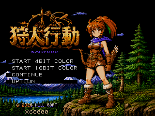
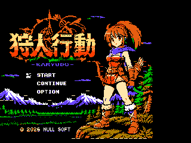
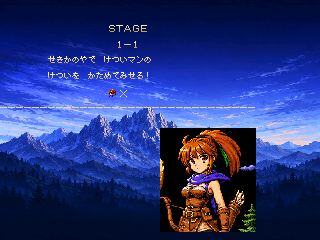
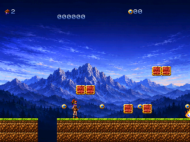
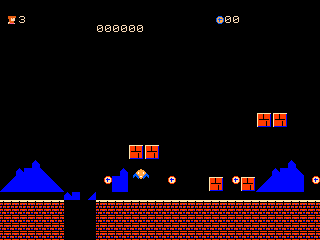

# Calude Kodo (狩人行動)

## fork元との違い

[GOROman/calude-famicom-game](https://github.com/GOROman/calude-famicom-game) のNES（ファミコン）版に、X68000向け移植を追加したforkです。原作の6502ソース・素材・NESビルド・ブラウザツールを残し、移植版は [`x68k/`](x68k/) に分離しています。

- **実行環境**：x68k-stackchanのHuman68k上で動く `GAME.X` を追加。全4ステージ・ボス・エンディングと、タイトル・ラウンド演出を移植しています。
- **描画・操作**：原作素材をG-VRAM・BG・スプライト向けに変換。W/A/S/D、J（矢）、K（ジャンプ）、Enter（開始・ポーズ）のキーボード操作に対応しています。
- **音**：NES APUの完全再現ではなく、YM2151 FM＋ADPCM向けにアレンジ。主旋律はトランペット風のFM音色、ドラムは原作DPCMから変換しています。
- **表示モード選択**：タイトルで `START 4BIT COLOR`（16色・原作風ドット絵）と `START 16BIT COLOR`（65536色・新しい多色背景）を選べます。既定は16bit、コンティニューでは選んだモードを保ちます。操作・ゲームの進行・FM＋ADPCMの音は共通です。
- **タイトル**：16bit版はイラストと「X68000」表記を追加。CoreS3の右64pxには背景を描き足し、元の絵や文字は引き伸ばしません。まばたき・ロゴの部分的な明滅があり、フェード中は16色へ戻します。4bit版は原作のドット絵を使います。
- **ゲーム画面**：16bit版では全4面の山と空に加えて、主人公・敵・地形・コインも65536色で描きます。原作の4bit素材とは別の多色原画を用意し、背景→HUD→地形→キャラクターの順にソフト合成します。ステージ開始画面も右端まで同じ多色背景を使い、台詞と顔の演出を重ねます。4bit版では従来のドット絵・BG背景・ラウンド画面へ戻し、エンディングは両モードとも16色です。



4bit／16bitを選べるタイトル（CoreS3実機、320×240）



16色モードの旧タイトル（CoreS3実機、320×240／X68000表記追加前）

新旧では色数だけでなく、原画と右側の背景も更新しています。



16bitステージ開始画面。台詞と顔は原作素材を保ち、右端まで各面の多色背景を表示します。



ゲーム画面（CoreS3実機、320×240）。山と空だけでなく、主人公・地形・ブロック・コインも65536色で描いています。



4bit版では従来のドット絵・BG背景で遊べます。右側のゲーム領域外も従来どおりで、16bit版の多色背景・多色キャラクターは表示しません。

実行ファイルはリポジトリ直下の [`GAME.X`](GAME.X)、ゲーム単体ディスクは [`game.xdf`](x68k/dist/game.xdf) です。ディスクはROM・Human68kを含まない非起動版なので、別のHuman68k環境から実行してください（[使い方](x68k/dist/README.md)）。

CoreS3向けエミュレータの速度・音声改善は、別リポジトリ [`x68k-stackchan`](https://github.com/kexi/x68k-stackchan) 側の改修で、このゲームのソースには含まれません。改修版でCoreS3のタイトル表示・ゲーム開始を確認していますが、処理速度・PCM供給不足は完全には解消しておらず、物理X68000での動作は未検証です。

導入・操作は [X68000版README](x68k/README.md)、検証範囲は [移植状況](knowledge/x68k-port-status.md)・[表示モード選択](knowledge/graphics-mode-selection.md)・[多色タイトル](knowledge/title-highcolor.md)・[FM音源の調整記録](knowledge/cores3-fm-trumpet.md) を参照してください。以下は原作NES版の説明です。

**English** | [日本語](README.ja.md)

A **side-scrolling action game for the NES (Famicom)** starring a young **huntress**, built from scratch in 6502 assembly (ca65). Developed step by step together with [Claude Code](https://claude.com/claude-code) (Fable 5).

## ▶ [PLAY IN YOUR BROWSER](https://goroman.github.io/cluade-famicom-emu/?pin=0&debug=1&rom=https://raw.githubusercontent.com/GOROman/calude-famicom-game/main/roms/50-coin-shine.nes)

*(latest build: roms/50-coin-shine.nes — boots directly in the cluade-famicom-emu WASM emulator)*

**🛠 [Stage Editor](https://goroman.github.io/calude-famicom-game/editor/)** — edit stages in the browser. The URL *is* the save data, and you can export a modified .nes and play it right away

**🎨 [PNG → CHR Converter](https://goroman.github.io/calude-famicom-game/tools/png2chr/)** — convert images into NES CHR data (.byte / .chr) with 4-color palettes

**🖌 [CHR-ROM Editor](https://goroman.github.io/calude-famicom-game/tools/chredit/)** — pixel-edit the ROM's tile graphics in the browser. Keyboard-driven (1–4 keys + space), with undo, save/load, and an animation checker. Export a modified .nes and play it

**🎞 [Animation Player](https://goroman.github.io/calude-famicom-game/tools/animplay/)** — loop-play frames extracted from video (13 frames of the huntress) with frame selection and adjustable FPS; the URL is the save data

**👁 [Blink Editor](https://goroman.github.io/calude-famicom-game/tools/blinkedit/)** — pixel-edit the title screen's eye-blink frames with a hardware-accurate preview. Apply the JSON to the assets with `tools/apply_blink.py`

Verification is done on the homemade WASM emulator [cluade-famicom-emu](https://github.com/GOROman/cluade-famicom-emu). (The spellings *calude* / *cluade* are intentional.)


## Story

The world has been conquered by the **Ketsui-Man** ("Resolve Man"). Ketsui-Man resolves. "I'll get serious tomorrow." "This time I'll really do it." "I will absolutely see it through." — He resolves, and then does nothing.

The huntress **Kalyudo** sets out again today. Her weapon is not the bow. It is **action**. She takes down those who only resolve, by actually moving — *Calude Kodo* ("Hunter Action"), a tale of those who act.

## Requirements

- Nix with flakes enabled (macOS or Linux)
- The repository's pinned Nix environment supplies [cc65](https://cc65.github.io/) (ca65 / ld65) and GNU Make, alongside the X68000 toolchain. No Homebrew installation is needed.

```sh
nix develop
```

With direnv, `direnv allow` activates the same environment automatically.

## Build

```sh
make          # builds game.nes (iNES format, Mapper 3 / CNROM, 16KB CHR)
make run      # serves cluade-famicom-emu locally and opens it in a browser
make clean
```

After `make run`, load `game.nes` via "Open ROM" in the browser.
(You can also load it directly into the [web emulator](https://goroman.github.io/cluade-famicom-emu/).)

## Controls

| Action | NES | Keyboard (cluade-famicom-emu) |
|------|-----|------|
| Move left / right | D-pad ← → | Arrow keys ← → |
| Jump (height varies with press length) | A | X |
| Bow (up to 2 arrows on screen) | B | Z |
| Pause | START | Enter |

## Tech Notes (highlights)

- **Game loop**: input → update → shadow OAM ($0200) in the main loop; OAM DMA in the NMI (vblank)
- **Jump physics**: SMB-style variable jump — 8.8 fixed-point Y velocity, weak gravity while A is held on the way up, strong gravity after release
- **Player**: 16x32 metasprite (8 hardware sprites), pose-based tile layout arranged as a visual grid in CHR (vertical neighbor = +16) so it can be edited as-is in the CHR-ROM editor
- **Scrolling**: two vertically-mirrored nametables used as a ring, SMB-style column streaming (one 30-tile column uploaded per NMI)
- **Title screen**: full-screen illustration using **CNROM (mapper 3) bank switching** plus a **sprite-0-hit raster split** (PT0→PT1) to break the 256-tile limit; the round screen reuses the same trick to show the title face on its bottom half via a mid-frame CHR bank switch
- **Checkpoint**: a mid-stage flag saves the respawn point (the only meta-column that has ground in all four stages)
- **Stages**: 1-1 to 1-4, each with its own palette mood (blue night → dusk purple → deep teal → showdown crimson) and an accelerating BGM tempo (8/7/7/6 frames per step)
- **Sound**: homemade TR-808-style driver — DPCM kick/snare synthesized in Python, noise hi-hat with software envelopes, TB-303-style triangle bass with portamento and vibrato; two songs plus SFX overlaid onto the BGM registers every frame

See the [Japanese README](README.ja.md) for the full technical notes and roadmap.

## Dev Diary

Essay-style development diaries (in Japanese) live in [docs/diary/](docs/diary/README.md), covering every step from "the day the sky turned blue" to raster splits, sprite sheets, and checkpoint flags.

## License

MIT
